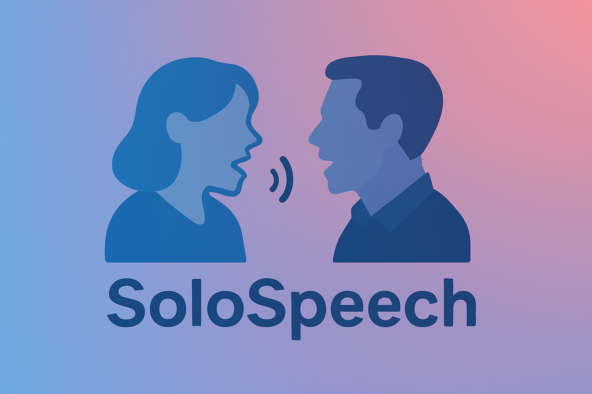

<p align="center">
  
</p>
<h3  align="center">🎸 SoloSpeech: Enhancing Intelligibility and Quality in Target Speaker Extraction through a Cascaded Generative Pipeline</h3>

<p align="center">
 <a href="https://arxiv.org/">📜 Paper</a> | <a href="https://">🎶 Demo</a> | <a href="https://huggingface.co/">🤖 Spaces</a> | <a href="https://huggingface.co/OpenSound/SoloSpeech-models/">🚀 Models</a>
</p>
<p align="center">
  
  
  
</p>

## Introduction

🎸 SoloSpeech is a novel ***cascaded generative pipeline*** that integrates compression, extraction, reconstruction, and correction processes. SoloSpeech achieves state-of-the-art ***intelligibility and quality*** in target speech extraction and speech separation tasks while demonstrating exceptional ***generalization on out-of-domain data***.

## Quick Start
- [Install and quick use](docs/quick_use.md)
- [Training](docs/training.md)
- [Evaluation](docs/README.md)


## Contributing

If you find this work useful, please consider contributing to this repo and cite this work:
```
@article{
}
```

## License
All listening samples, source code, pretrained checkpoints, and the evaluation toolkit are licensed under the Creative Commons Attribution-NonCommercial 4.0 International License (CC BY-NC 4.0).  
See the [LICENSE](./LICENSE) file for details.

## Acknowledgements

This implementation is based on [SoloAudio](https://github.com/WangHelin1997/SoloAudio), [EzAudio](https://github.com/haidog-yaqub/EzAudio), [DPM-TSE](https://github.com/haidog-yaqub/DPMTSE), and [stable-audio-tools](https://github.com/Stability-AI/stable-audio-tools). We appreciate their awesome work.


